# 🤖 Bad Dave's Robot Army - Your Elite Development Force

## Welcome to the Front Lines, Commander!

You've just gained command of an elite squad of specialized AI agents, each a battle-hardened veteran of countless deployments. This isn't just a collection of tools - it's a coordinated development force that can transform ideas into production-ready code with military precision. No bugs left behind, no feature unconquered!

## 🎯 What Is Bad Dave's Robot Army?

Bad Dave's Robot Army is a comprehensive suite of Claude Code subagents and slash commands that supercharge your development workflow. Think of it as having an entire expert development team at your fingertips, each member specialized in their domain and ready to execute complex operations. From the trenches of legacy code to the high ground of cloud architecture, your forces are ready for any engagement.

## 🚀 Quick Start - Your First Mission

```bash
# Get an overview of any codebase
/codebase-overview

# Need something explained?
/explain [any file or concept]

# Ready to build? Create a PRD
/create-prd your-requirements.md

# Or jump straight to implementation
/implement-issue 42
```

## 💪 Your Elite Squad - The Subagents

### Core Development Team - The Front Line

| Agent | Specialty | When to Deploy |
|-------|-----------|---------------|
| **@agent-architect** | System design & architecture | Structural changes, new services, API design |
| **@agent-refactorer** | Code improvement & cleanup | Making code cleaner and more maintainable |
| **@agent-debugger** | Problem investigation & fixes | Tracking down bugs and errors |
| **@agent-build-master** | Build systems & CI/CD pipelines | Build optimization, compilation, packaging |
| **@agent-test-automator** | Comprehensive test suites | Writing unit, integration, and e2e tests |

### Specialized Forces - Elite Operations

| Agent | Specialty | When to Deploy |
|-------|-----------|---------------|
| **@agent-security-master** | Security & vulnerability prevention | Auth, encryption, security reviews |
| **@agent-api-designer** | RESTful API design | Creating consistent, well-documented APIs |
| **@agent-database-designer** | Schema & query optimization | Database design, performance tuning |
| **@agent-cloud-developer** | AWS architecture & scalability | Cloud infrastructure, serverless, scaling |
| **@agent-code-modernizer** | Legacy code transformation | Upgrading old code, adopting new patterns |
| **@agent-performance-optimizer** | Speed & efficiency | Slow code, bottlenecks, optimization |

### Support Division - The Logistics Corps

| Agent | Specialty | When to Deploy |
|-------|-----------|---------------|
| **@agent-deployment-specialist** | CI/CD & release management | Deployment pipelines, zero-downtime releases |
| **@agent-quality-assurance-expert** | Testing strategies & quality | Test coverage, defect prevention |
| **@agent-concurrency-expert** | Threading & parallel processing | Async operations, race conditions |
| **@agent-accessibility-specialist** | WCAG compliance & usability | Making apps accessible to everyone |
| **@agent-internationalization-specialist** | Multi-language support | Localization, i18n implementation |
| **@agent-exception-handling-master** | Error handling & resilience | Robust exception management, recovery strategies |
| **@agent-configuration-manager** | Config & environment management | Application settings, secrets, deployment configs |
| **@agent-logging-master** | Logging & observability | Debug logging, monitoring, audit trails |

### Special Operations - Black Ops Division

| Agent | Specialty | When to Deploy |
|-------|-----------|---------------|
| **@agent-mentor** | Teaching & knowledge transfer | Learning, explanations, onboarding new recruits |
| **@agent-junior-developer** | Learning-focused development | Fresh perspective, questioning assumptions, learning together |
| **@agent-product-manager** | Requirements & planning | Feature planning, user stories, mission briefings |
| **@agent-development-manager** | Technical planning & coordination | Breaking down complex campaigns |
| **@agent-toolsmith** | Developer experience | Build tools, automation, weaponry upgrades |
| **@agent-code-documentor** | Documentation & clarity | War journals and operational manuals |

## 🎖️ Command Structure - The Workflows

### 1. The PRD → Production Pipeline

The most powerful workflow - from idea to deployed feature:

```mermaid
graph LR
    A[Requirements] -->|/create-prd| B[PRD Document]
    B -->|/process-prd-feedback| B1[Refined PRD]
    B1 -->|/implementation-plan-from-prd| C[Implementation Plan]
    C -->|/process-implementation-plan-feedback| C1[Battle-Ready Plan]
    C1 -->|/tasks-from-plan| D[GitHub Issues]
    D -->|/implement-issue| E[Implemented Code]
    E -->|Review & Test| F[Production]
```



**Example Campaign - Operation: Feature Storm**
```bash
# Step 1: Initial reconnaissance - Create a PRD from your requirements
/create-prd requirements/new-feature.md

# Step 2: Review the battle plan
# Step 3: Process intelligence feedback
/process-prd-feedback "Add mobile support, need air cover"

# Step 4: Generate tactical implementation plan
/implementation-plan-from-prd /plans/prd-*.md

# Step 5: Refine tactics based on field reports
/process-implementation-plan-feedback "Prioritize backend first"

# Step 6: Deploy troops - Create GitHub issues from the plan
/tasks-from-plan /plans/implementation-plan-*.md

# Step 7: Execute the mission - Implement each issue
/implement-issue 101  # Alpha squad, move out!
/implement-issue 102  # Bravo squad, go go go!
```

### 2. The Review & Improve Protocol

Systematic code improvement across all dimensions:

```bash
# Security audit
/security-review "current changes"

# Performance analysis  
/perf-review src/slow-module

# Architecture review
/arch-review "PR #45"

# Full quality assessment
/quality-review

# Database optimization
/database-review
```

Each review generates a comprehensive report in `/plans/` with:
- Current state analysis
- Prioritized issues (Critical/High/Medium/Low)
- Detailed improvement plan
- Effort estimates
- Success metrics

### 3. The Learning & Mastery Path

For understanding and knowledge transfer:

```bash
# Understand the codebase
/codebase-overview

# Get personalized explanations
/explain src/complex-algorithm.ts

# Approach with fresh curiosity
/beginners-mind authentication flow

# Create a learning path
/learn React hooks in this project

# Deep dive into architecture
/arch-review
```

## 🎮 Advanced Tactics

### Scope Modifiers for Reviews - Target Acquisition

All review commands support intelligent target acquisition:

- **No argument** - Review entire project
- **Path** - Review specific file/directory
- **"current changes"** - Review uncommitted changes
- **"recent changes"** - Review recent commits  
- **"PR #123"** - Review a pull request

### Coordinated Attacks - Combined Arms Operations

Deploy multiple agents for complex operations - shock and awe tactics:

```bash
# Modernize and optimize simultaneously
/modernization-review src/legacy
/perf-review src/legacy
/tasks-from-plan /plans/modernization-review-*.md
```

### Specialized Formations - Battle Tactics

For specific combat scenarios:

**Operation: Fort Knox - Security Hardening**
```bash
/security-review
/test-review  # Ensure security tests
/deployment-review  # Secure deployment
```

**Operation: Lightning Strike - Performance Blitz**
```bash
/perf-review
/database-review
/concurrency-review
```

**Operation: Zero Defects - Quality Offensive**
```bash
/quality-review
/test-review
/doc-review
```

## 📊 Best Practices from the Field

### 1. Start with Reconnaissance - Know Your Battlefield
Always begin with `/codebase-overview` or `/explain` to understand the terrain.

### 2. Plan Before Attacking - No Plan Survives First Contact (But Have One Anyway)
Use `/create-prd` or `/decompose-issue` for complex tasks. Let the development-manager break down the work.

### 3. Deploy Specialists - Right Tool for the Right Mission
Don't send infantry when you need special forces. Use @agent-api-designer for APIs, not @agent-architect. Would you send a tank pilot to defuse a bomb?

### 4. Review After Action - Debrief and Learn
After implementation, run relevant review commands to ensure quality.

### 5. Document Victories - War Stories for Future Generations
The @agent-code-documentor should follow major implementations to maintain clarity. Every great battle deserves its historian.

### 6. Coordinate Forces - Combined Arms Doctrine
Multiple agents can work in parallel - use the todo system as your battle map. Remember: amateurs talk strategy, professionals talk logistics.

## 🛠️ Integration with Your Workflow

### With GitHub Issues
```bash
# Decompose large issues
/decompose-issue 42

# Implement with the right specialist
/implement-issue 43

# Create PRs with context
/create-pr "recent changes"
```

### With Existing Code
```bash
# Understand before modifying
/explain src/module.ts

# Review before refactoring
/refactor-review src/module.ts

# Modernize systematically
/modernization-review src/legacy
```

### For New Features
```bash
# Start with requirements
/create-prd feature-spec.md

# Or decompose an issue
/decompose-issue 100

# Then implement systematically
/implement-issue 101
```

## 🎯 Mission Types - Choose Your Engagement

### The Quick Strike - Surgical Precision
For small, focused tasks:
```bash
/implement-issue 42
```

### The Planned Campaign - Full Scale Invasion  
For complex features:
```bash
/create-prd → /process-prd-feedback → /tasks-from-plan → /implement-issue (multiple)
```

### The Audit Operation - Inspection Ready
For code quality:
```bash
/security-review → /perf-review → /quality-review
```

### The Learning Mission - Intelligence Gathering
For understanding:
```bash
/codebase-overview → /explain → /learn
```

## 💡 Pro Tips from the Veterans

1. **Use the mentor for onboarding** - `/learn this codebase` creates personalized boot camp training

2. **Deploy the junior developer for fresh perspectives** - `/beginners-mind` or @agent-junior-developer questions assumptions and uncovers hidden complexity

3. **Chain reviews for comprehensive analysis** - Security → Performance → Quality (The holy trinity of code warfare)

4. **Let specialists own their domain** - @agent-database-designer for schemas, @agent-api-designer for endpoints. Trust your officers!

5. **Track complex work with todos** - Your mission control dashboard. Never lose sight of objectives!

6. **Review PRs before merging** - `/arch-review "PR #123"` - Final inspection before deployment to production theater

7. **Document as you go** - @agent-code-documentor should follow feature implementation. Leave no soldier's story untold!

8. **Modernize incrementally** - Use `/modernization-review` to identify upgrade opportunities. Rome wasn't rebuilt in a day!

## 🚁 Emergency Protocols - When Things Go FUBAR

**When stuck (Code KIA - Knowledge In Absence):**
```bash
/explain [confusing-code]
/mentor  # Get personalized help
```

**When slow (Performance MIA - Missing In Action):**
```bash
/perf-review
/database-review
/concurrency-review
```

**When buggy (Hostile Bugs Detected):**
```bash
@agent-debugger  # Call in the bug hunter
/test-review  # Fortify your defenses
```

**When messy (Code Discipline Breakdown):**
```bash
/refactor-review
/arch-review
```

## 📈 Success Metrics - Victory Conditions

Your Robot Army helps you achieve total development dominance:

- ✅ **Faster Development** - Multiple fronts, parallel operations
- ✅ **Higher Quality** - No bug survives first contact with review squad  
- ✅ **Better Architecture** - Battle-tested patterns and fortified structures
- ✅ **Improved Security** - Fort Knox-level vulnerability prevention
- ✅ **Comprehensive Testing** - Automated test battalions guard every function
- ✅ **Clear Documentation** - Field manuals that actually make sense
- ✅ **Knowledge Transfer** - Boot camp training for all skill levels

## 🎖️ Your Command Center - Mission Control

```
/bad-daves-robot-army    # Field manual and doctrine
/help                     # Call for backup
/agents                   # Roll call - see your troops
/commands                 # Arsenal inspection
```

## 🚀 Ready for Your First Mission, Soldier?

1. **Recon**: `/codebase-overview` - Scout the terrain
2. **Strategy**: `/create-prd your-idea.md` - Draw up battle plans
3. **Tactics**: `/implementation-plan-from-prd` - Detailed maneuvers
4. **Assault**: `/implement-issue` - Weapons hot, engage!
5. **Debrief**: `/quality-review` - Confirm victory, count casualties

Remember: You're not just writing code - you're commanding an elite force of AI specialists, each a decorated veteran with more confirmed bug kills than you can count. Use them wisely, and there's no development challenge you can't conquer. Leave no feature behind!

**Welcome to Bad Dave's Robot Army, Commander. Your forces await your orders!**

*Ten-HUT! 🫡*

---

*"In code we trust, in automation we thrive, no bug survives."* - Bad Dave's Robot Army Motto

*"The only easy day was yesterday's deployment."* - Robot Army SEAL Team Six