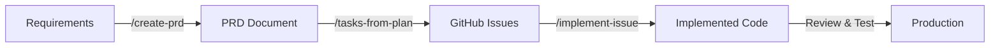

# 🤖 Bad Dave's Robot Army - Your Elite Development Force

## Welcome, Commander!

You've just gained command of an elite squad of specialized AI agents, each a master of their craft. This isn't just a collection of tools - it's a coordinated development force that can transform ideas into production-ready code with military precision.

## 🎯 What Is Bad Dave's Robot Army?

Bad Dave's Robot Army is a comprehensive suite of Claude Code subagents and slash commands that supercharge your development workflow. Think of it as having an entire expert development team at your fingertips, each member specialized in their domain and ready to execute complex operations.

## 🚀 Quick Start - Your First Mission

```bash
# Get an overview of any codebase
/codebase-overview

# Need something explained?
/explain [any file or concept]

# Ready to build? Create a PRD
/create-prd your-requirements.md

# Or jump straight to implementation
/implement-issue 42
```

## 💪 Your Elite Squad - The Subagents

### Core Development Team

| Agent | Specialty | When to Deploy |
|-------|-----------|---------------|
| **@architect** | System design & architecture | Structural changes, new services, API design |
| **@code-modernizer** | Legacy code transformation | Upgrading old code, adopting new patterns |
| **@refactorer** | Code improvement & cleanup | Making code cleaner and more maintainable |
| **@debugger** | Problem investigation & fixes | Tracking down bugs and errors |
| **@performance-optimizer** | Speed & efficiency | Slow code, bottlenecks, optimization |

### Specialized Forces

| Agent | Specialty | When to Deploy |
|-------|-----------|---------------|
| **@security-master** | Security & vulnerability prevention | Auth, encryption, security reviews |
| **@test-automator** | Comprehensive test suites | Writing unit, integration, and e2e tests |
| **@api-designer** | RESTful API design | Creating consistent, well-documented APIs |
| **@database-designer** | Schema & query optimization | Database design, performance tuning |
| **@cloud-developer** | AWS architecture & scalability | Cloud infrastructure, serverless, scaling |

### Support Division

| Agent | Specialty | When to Deploy |
|-------|-----------|---------------|
| **@deployment-specialist** | CI/CD & release management | Deployment pipelines, zero-downtime releases |
| **@quality-assurance-expert** | Testing strategies & quality | Test coverage, defect prevention |
| **@concurrency-expert** | Threading & parallel processing | Async operations, race conditions |
| **@accessibility-specialist** | WCAG compliance & usability | Making apps accessible to everyone |
| **@internationalization-specialist** | Multi-language support | Localization, i18n implementation |

### Special Operations

| Agent | Specialty | When to Deploy |
|-------|-----------|---------------|
| **@mentor** | Teaching & knowledge transfer | Learning, explanations, onboarding |
| **@product-manager** | Requirements & planning | Feature planning, user stories |
| **@development-manager** | Technical planning & coordination | Breaking down complex projects |
| **@toolsmith** | Developer experience | Build tools, automation, workflows |
| **@code-documentor** | Documentation & clarity | Creating clear, helpful documentation |

## 🎖️ Command Structure - The Workflows

### 1. The PRD → Production Pipeline

The most powerful workflow - from idea to deployed feature:



**Example Campaign:**
```bash
# Step 1: Create a PRD from your requirements
/create-prd requirements/new-feature.md

# Step 2: Review the generated PRD
# Step 3: Process feedback if needed
/process-prd-feedback "Add mobile support"

# Step 4: Create GitHub issues from the PRD
/tasks-from-plan /plans/prd-*.md

# Step 5: Implement each issue
/implement-issue 101
/implement-issue 102
```

### 2. The Review & Improve Protocol

Systematic code improvement across all dimensions:

```bash
# Security audit
/security-review "current changes"

# Performance analysis  
/perf-review src/slow-module

# Architecture review
/arch-review "PR #45"

# Full quality assessment
/quality-review

# Database optimization
/database-review
```

Each review generates a comprehensive report in `/plans/` with:
- Current state analysis
- Prioritized issues (Critical/High/Medium/Low)
- Detailed improvement plan
- Effort estimates
- Success metrics

### 3. The Learning & Mastery Path

For understanding and knowledge transfer:

```bash
# Understand the codebase
/codebase-overview

# Get personalized explanations
/explain src/complex-algorithm.ts

# Create a learning path
/learn React hooks in this project

# Deep dive into architecture
/arch-review
```

## 🎮 Advanced Tactics

### Scope Modifiers for Reviews

All review commands support intelligent scoping:

- **No argument** - Review entire project
- **Path** - Review specific file/directory
- **"current changes"** - Review uncommitted changes
- **"recent changes"** - Review recent commits  
- **"PR #123"** - Review a pull request

### Coordinated Attacks

Deploy multiple agents for complex operations:

```bash
# Modernize and optimize simultaneously
/modernization-review src/legacy
/perf-review src/legacy
/tasks-from-plan /plans/modernization-review-*.md
```

### Specialized Formations

For specific scenarios:

**The Security Hardening**
```bash
/security-review
/test-review  # Ensure security tests
/deployment-review  # Secure deployment
```

**The Performance Blitz**
```bash
/perf-review
/database-review
/concurrency-review
```

**The Quality Offensive**
```bash
/quality-review
/test-review
/doc-review
```

## 📊 Best Practices from the Field

### 1. Start with Reconnaissance
Always begin with `/codebase-overview` or `/explain` to understand the terrain.

### 2. Plan Before Attacking
Use `/create-prd` or `/decompose-issue` for complex tasks. Let the development-manager break down the work.

### 3. Deploy Specialists
Don't use generic agents when specialists exist. Use @api-designer for APIs, not @architect.

### 4. Review After Action
After implementation, run relevant review commands to ensure quality.

### 5. Document Victories
The @code-documentor should follow major implementations to maintain clarity.

### 6. Coordinate Forces
Multiple agents can work in parallel - use the todo system to track progress.

## 🛠️ Integration with Your Workflow

### With GitHub Issues
```bash
# Decompose large issues
/decompose-issue 42

# Implement with the right specialist
/implement-issue 43

# Create PRs with context
/create-pr "recent changes"
```

### With Existing Code
```bash
# Understand before modifying
/explain src/module.ts

# Review before refactoring
/refactor-review src/module.ts

# Modernize systematically
/modernization-review src/legacy
```

### For New Features
```bash
# Start with requirements
/create-prd feature-spec.md

# Or decompose an issue
/decompose-issue 100

# Then implement systematically
/implement-issue 101
```

## 🎯 Mission Types

### The Quick Strike
For small, focused tasks:
```bash
/implement-issue 42
```

### The Planned Campaign  
For complex features:
```bash
/create-prd → /process-prd-feedback → /tasks-from-plan → /implement-issue (multiple)
```

### The Audit Operation
For code quality:
```bash
/security-review → /perf-review → /quality-review
```

### The Learning Mission
For understanding:
```bash
/codebase-overview → /explain → /learn
```

## 💡 Pro Tips

1. **Use the mentor for onboarding** - `/learn this codebase` creates personalized learning paths

2. **Chain reviews for comprehensive analysis** - Security → Performance → Quality

3. **Let specialists own their domain** - @database-designer for schemas, @api-designer for endpoints

4. **Track complex work with todos** - The system automatically manages task lists

5. **Review PRs before merging** - `/arch-review "PR #123"` ensures consistency

6. **Document as you go** - @code-documentor should follow feature implementation

7. **Modernize incrementally** - Use `/modernization-review` to identify upgrade opportunities

## 🚁 Emergency Protocols

**When stuck:**
```bash
/explain [confusing-code]
/mentor  # Get personalized help
```

**When slow:**
```bash
/perf-review
/database-review
/concurrency-review
```

**When buggy:**
```bash
@debugger  # Direct agent invocation
/test-review  # Improve test coverage
```

**When messy:**
```bash
/refactor-review
/arch-review
```

## 📈 Success Metrics

Your Robot Army helps you achieve:

- ✅ **Faster Development** - Specialized agents work in parallel
- ✅ **Higher Quality** - Systematic reviews catch issues early  
- ✅ **Better Architecture** - Consistent patterns and best practices
- ✅ **Improved Security** - Proactive vulnerability prevention
- ✅ **Comprehensive Testing** - Automated test generation
- ✅ **Clear Documentation** - Maintained as code evolves
- ✅ **Knowledge Transfer** - Personalized learning and explanations

## 🎖️ Your Command Center

```
/bad-daves-robot-army    # This guide
/help                     # General help
/agents                   # List all agents
/commands                 # List all commands
```

## 🚀 Ready for Your First Mission?

1. **Explore**: `/codebase-overview` - Understand your battlefield
2. **Plan**: `/create-prd your-idea.md` - Strategic planning
3. **Execute**: `/implement-issue` - Deploy your forces
4. **Review**: `/quality-review` - Ensure victory

Remember: You're not just writing code - you're commanding an elite force of AI specialists, each the best at what they do. Use them wisely, and there's no development challenge you can't conquer.

**Welcome to Bad Dave's Robot Army, Commander. Your forces await your orders!**

---

*"In code we trust, in automation we thrive."* - Bad Dave's Robot Army Motto