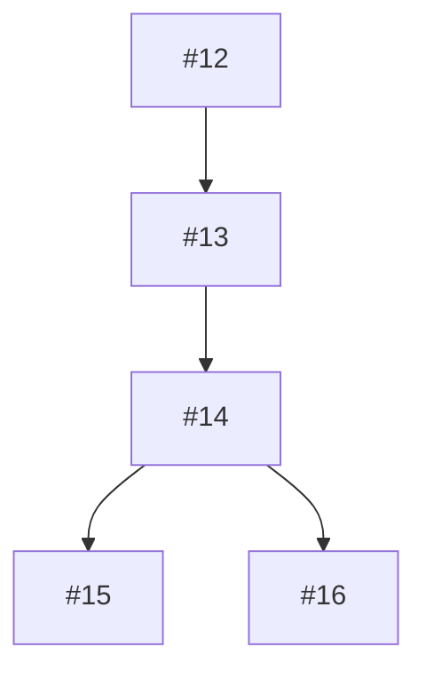

# decompose-issue

Break down a large GitHub issue into smaller, manageable sub-issues with appropriate linkages and dependencies.

## Usage
```
/decompose-issue {issue_number_or_url}
```

## Examples
- `/decompose-issue 4` - Decompose issue #4 into sub-issues
- `/decompose-issue https://github.com/owner/repo/issues/4` - Decompose issue from URL

## Description
This command analyzes a complex issue and intelligently breaks it down into smaller, atomic tasks that can each be implemented in a single PR. It maintains traceability through GitHub issue linking and dependency tracking.

## Workflow

### 1. Issue Analysis
- Fetch the parent issue details
- Analyze scope and complexity
- Identify logical boundaries for decomposition
- Extract success criteria and requirements

### 2. Decomposition Strategy
The command uses several strategies to identify sub-tasks:
- **Functional decomposition**: Separate by feature/functionality
- **Technical layers**: Split by architectural layers (frontend/backend/database)
- **Dependency chains**: Identify what must be done first
- **Testing boundaries**: Separate implementation from testing
- **Documentation needs**: Split docs into separate tasks

### 3. Sub-Issue Creation
For each identified sub-task:
- Create descriptive title prefixed with parent issue number
- Include context from parent issue
- Define clear scope and success criteria
- Assign appropriate specialist agent
- Set priority based on dependencies
- Add labels inherited from parent plus specific ones

### 4. Linking and Dependencies
- Add "Part of #parent" reference in each sub-issue
- Create dependency comments showing order
- Update parent issue with checklist of sub-issues
- Add "has-subtasks" label to parent
- Create milestone if appropriate

## Decomposition Patterns

### Large Feature Implementation
```
Parent: Implement user authentication system
Sub-issues:
├── #12: Implement user model and database schema
├── #13: Create authentication service layer
├── #14: Build login/logout API endpoints
├── #15: Add session management
├── #16: Implement password reset flow
├── #17: Add authentication middleware
├── #18: Create authentication UI components
└── #19: Write authentication tests
```

### Complex Refactoring
```
Parent: Refactor monolithic service into microservices
Sub-issues:
├── #20: Extract user service
├── #21: Extract payment service
├── #22: Extract notification service
├── #23: Implement service communication
├── #24: Update deployment configuration
└── #25: Migrate existing data
```

### Performance Optimization
```
Parent: Optimize application performance
Sub-issues:
├── #26: Profile and identify bottlenecks
├── #27: Optimize database queries
├── #28: Implement caching layer
├── #29: Add lazy loading
├── #30: Optimize bundle size
└── #31: Add performance monitoring
```

## Sub-Issue Template

```markdown
## Overview
This is part of #parent_number: {parent_title}

## Scope
{specific_scope_for_this_subtask}

## Requirements
- {requirement_1}
- {requirement_2}

## Success Criteria
- [ ] {criterion_1}
- [ ] {criterion_2}

## Dependencies
- Depends on: #{other_issue_number} (if applicable)
- Blocks: #{blocked_issue_number} (if applicable)

## Recommended Specialist
@agent-{specialist_name}

## Parent Issue Context
{relevant_context_from_parent}

## Notes
- Estimated effort: {estimate}
- Priority: {High/Medium/Low}
```

## Parent Issue Update

After decomposition, the parent issue is updated with:

```markdown
## Decomposition

This issue has been broken down into the following sub-tasks:

### Implementation Tasks
- [ ] #12: {title} - @agent-name
- [ ] #13: {title} - @agent-name
- [ ] #14: {title} - @agent-name

### Testing Tasks
- [ ] #15: {title} - @agent-test-case-developer

### Documentation Tasks
- [ ] #16: {title} - @agent-code-documentor

### Dependencies


**Note**: This issue is now tracked through its sub-issues. It will be closed automatically when all sub-issues are completed.
```

## Intelligent Decomposition Rules

1. **Size Limits**: Each sub-issue should be completable in 1-2 days
2. **Single Responsibility**: Each sub-issue has one clear objective
3. **Independent Testing**: Each can be tested in isolation
4. **Clear Dependencies**: Explicit ordering when required
5. **Specialist Alignment**: Each maps to appropriate agent expertise

## Agent Assignment Logic

| Sub-task Type | Assigned Specialist |
|--------------|-------------------|
| API endpoints | @agent-architect |
| Database changes | @agent-configuration-manager |
| UI components | @agent-accessibility-specialist |
| Testing | @agent-test-case-developer |
| Documentation | @agent-code-documentor |
| Performance | @agent-performance-optimizer |
| Security | @agent-security-master |
| Refactoring | @agent-refactorer |
| Bug fixes | @agent-debugger |
| Build/Deploy | @agent-build-master |

## Options

- `--max-size {n}`: Maximum number of sub-issues to create
- `--auto-assign`: Automatically assign agents based on analysis
- `--create-milestone`: Create milestone for all sub-issues
- `--priority {high|medium|low}`: Set priority for all sub-issues

## Example Output

```
Analyzing issue #4: Refactor sync script into modular functions
✓ Issue complexity: High (estimated 5-8 days)
✓ Identified 6 logical sub-tasks
✓ Creating sub-issues...

Created sub-issues:
├── #32: Extract file comparison functions (assigned: @agent-refactorer)
├── #33: Create validation module (assigned: @agent-test-case-developer)
├── #34: Implement error handling module (assigned: @agent-exception-handling-master)
├── #35: Create logging functions (assigned: @agent-logging-master)
├── #36: Write unit tests for modules (assigned: @agent-test-case-developer)
└── #37: Update documentation (assigned: @agent-code-documentor)

✓ Updated parent issue #4 with sub-task checklist
✓ Added dependency relationships
✓ Created milestone: "Sync Script Refactoring"

View parent issue: https://github.com/owner/repo/issues/4
```

## Benefits

- **Manageable PRs**: Each sub-issue results in a focused PR
- **Parallel Work**: Independent sub-tasks can be worked on simultaneously
- **Clear Progress**: Checklist in parent shows overall progress
- **Better Estimates**: Smaller tasks are easier to estimate
- **Specialist Optimization**: Each task goes to the right expert
- **Reduced Complexity**: Breaking down makes large tasks approachable

## Notes
- Use this when an issue would result in 200+ lines of changes
- Particularly useful for architectural changes
- Helps maintain clean git history with atomic commits
- Enables better code review with smaller PRs